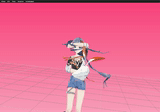

## DanceCamAnimator &mdash; Official PyTorch implementation

Code for ACM MM 2024 paper "DanceCamAnimator: Keyframe-Based Controllable 3D Dance Camera Synthesis"
[[Paper]](https://arxiv.org/abs/2409.14925) [[Project Page]](https://carmenw1203.github.io/DanceCamAnimator.github.io/) [[Video]](https://www.youtube.com/watch?v=pQa2B78fu0Y)

✨ Do not hesitate to give a star! ✨

<p float="left">
	    
	</p>

> Synthesizing camera movements from music and dance is highly challenging due to the contradicting requirements and complexities of dance cinematography. Unlike human movements, which are always continuous,  dance camera movements involve both continuous sequences of variable lengths and sudden drastic changes to simulate the switching of multiple cameras. However, in previous works, every camera frame is equally treated and this causes jittering and unavoidable smoothing in post-processing. To solve these problems, we propose to integrate animator dance cinematography knowledge by formulating this task as a three-stage process: keyframe detection, keyframe synthesis, and tween function prediction. Following this formulation, we design a novel end-to-end dance camera synthesis framework **DanceCamAnimator**, which imitates human animation procedures and shows powerful keyframe-based controllability with variable lengths. Extensive experiments on the DCM dataset demonstrate that our method surpasses previous baselines quantitatively and qualitatively.

## Requirements

* 64-bit Python 3.7+
* PyTorch 1.12.1
* At least 18 GB RAM per GPU
* 1&ndash;4 high-end NVIDIA GPUs with at least 18 GB of GPU memory, NVIDIA drivers, CUDA 11.6 toolkit.

The example build this repo was validated on:

* Linux ubuntu 4.15.0-213-generic
* 64-bit Python 3.7.12
* PyTorch 1.13.1
* 18 GB RAM
* 4 x NVIDIA RTX 3090, CUDA 11.6 toolkit

This repository additionally depends on the following library, which may require special installation procedures:

* [accelerate](https://huggingface.co/docs/accelerate/v0.16.0/en/index)
  * Note: after installation, don't forget to run `accelerate config` . We use fp16 following [EDGE](https://github.com/Stanford-TML/EDGE/blob/main/README.md).

## Getting started

### Download DCM Dataset and prepare for DanceCamAnimator

* Download and Check the DCM dataset following [DanceCamera3D](https://github.com/Carmenw1203/DanceCamera3D-Official) and put it under the `DCM_data/` folder.
* Preprocess the data by running

```.bash
bash sh/data_preprocess.sh
```

* Make DCM++ dataset which is keyframe-aware by running

```.bash
bash sh/make_dcm_plusplus.sh
```

### Quickstart

* Download the saved model checkpoints from [Stage1](https://drive.google.com/file/d/17ggTNO-oskjMZt6C1W6XrsYyXEtNrPxB/view?usp=sharing) and [Stage2&amp;3](https://drive.google.com/file/d/1S4zWbjhcwQd8Lsj-NwBM2kHcd-xP3ggH/view?usp=sharing) .
* Put the downloaded checkpoints under `checkpoints` folder and rename them as `DCA_stage1.pt` and `DCA_stage2n3.pt`.
* Generate temporal keyframe information with stage1 model by running

```.bash
bash sh/test_stage1.sh
```

* Generate camera movement with stage2&3 model (given temporal keyframe information from stage1)

```.bash
bash sh/test_stage2n3.sh
```

* Evaluate

```.bash
bash sh/evaluate.sh
```

#### Keyframe Temporal Control

* Generate camera movement with stage2&3 model (given temporal keyframe information from ground truth)

```.bash
bash sh/test_stage2n3_ablate_stage1_w_gt.sh
```

#### Keyframe Spatio-Temporal Control

* Generate camera movement with stage3 model (given spatio-temporal keyframe information from ground truth)

```.bash
bash sh/test_stage3_ablate_stage1n2_w_gt.sh
```

### Training process

* Train the stage1 by running

```.bash
bash sh/train_stage1.sh
```

* Train the stage2 and stage3 by running

```.bash
bash sh/train_stage2n3.sh
```

### Visualization

* Convert the results to `.vmd` format that can be viewed in [Saba_Viewer](https://github.com/benikabocha/saba) by running

```.bash
python3 scripts/extend_camera_results.py --split_json DCM_data/split/long2short.json \
--source_camera_dir output/test_DCA/etest/CameraCentric \
--target_camera_extend_dir output/test_DCA/etest/extend_json \
--target_camera_vmdjson_dir output/test_DCA/etest/extend_vmdjson

python3 scripts/json2vmd.py \
--json_dir output/test_DCA/etest/extend_vmdjson/ \
--vmd_dir output/test_DCA/etest/extend_vmd/ \
--data_type camera
```

* Follow [Visualization of DanceCamera3D](https://github.com/Carmenw1203/DanceCamera3D-Official?tab=readme-ov-file#visualization) to get human model, as while as modify and re-compile the Saba_Viewer project.

## Development

This is a research implementation and, in general, will not be regularly updated or maintained long after release.

## Citation

If you find this work useful for your research, please cite our papers:

```.bash
@InProceedings{wang2024dancecamanimator,
  title={DanceCamAnimator: Keyframe-Based Controllable 3D Dance Camera Synthesis},
  author={Wang, Zixuan and Li, Jiayi and Qin, Xiaoyu and Sun, Shikun and Zhou, Songtao and Jia, Jia and Luo, Jiebo},
  booktitle={Proceedings of the 32nd ACM International Conference on Multimedia},
  pages={xxxx--xxxx},
  year={2024}
}

@InProceedings{Wang_2024_CVPR,
    author    = {Wang, Zixuan and Jia, Jia and Sun, Shikun and Wu, Haozhe and Han, Rong and Li, Zhenyu and Tang, Di and Zhou, Jiaqing and Luo, Jiebo},
    title     = {DanceCamera3D: 3D Camera Movement Synthesis with Music and Dance},
    booktitle = {Proceedings of the IEEE/CVF Conference on Computer Vision and Pattern Recognition (CVPR)},
    month     = {June},
    year      = {2024},
    pages     = {7892-7901}
}
```

## Acknowledgements

We would like to thank [benikabocha](https://github.com/benikabocha) for the [Saba_Viewer](https://github.com/benikabocha/saba), [Stanford-TML](https://github.com/Stanford-TML) for the [EDGE](https://github.com/Stanford-TML/EDGE/blob/main/README.md), and [lucidrains](https://github.com/lucidrains) for the [Adan](https://github.com/lucidrains/Adan-pytorch) and [diffusion](https://github.com/lucidrains/denoising-diffusion-pytorch) repos. We would like to express our sincerest gratitude to all providers of publicly available data that we use.
